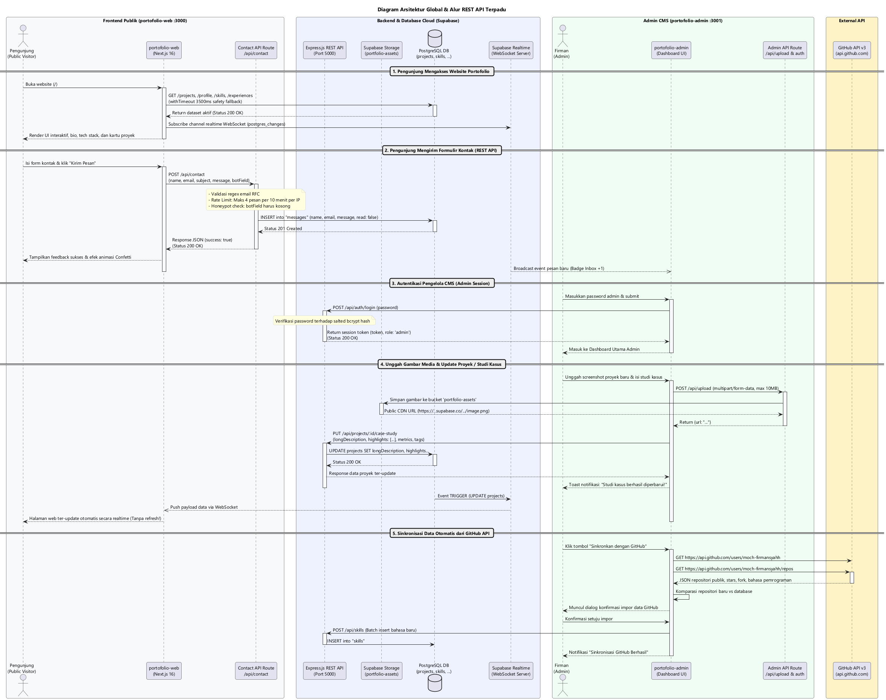
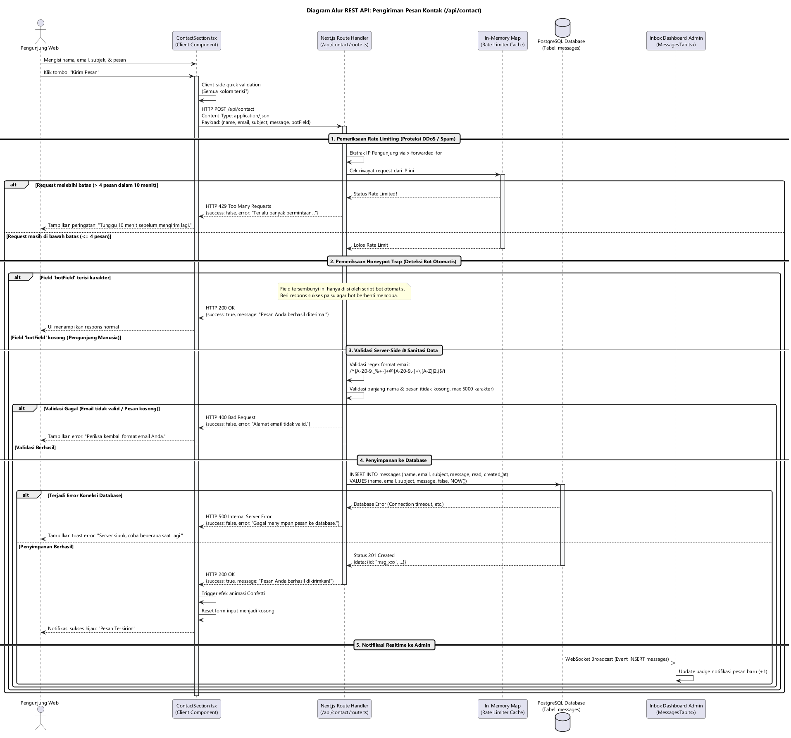
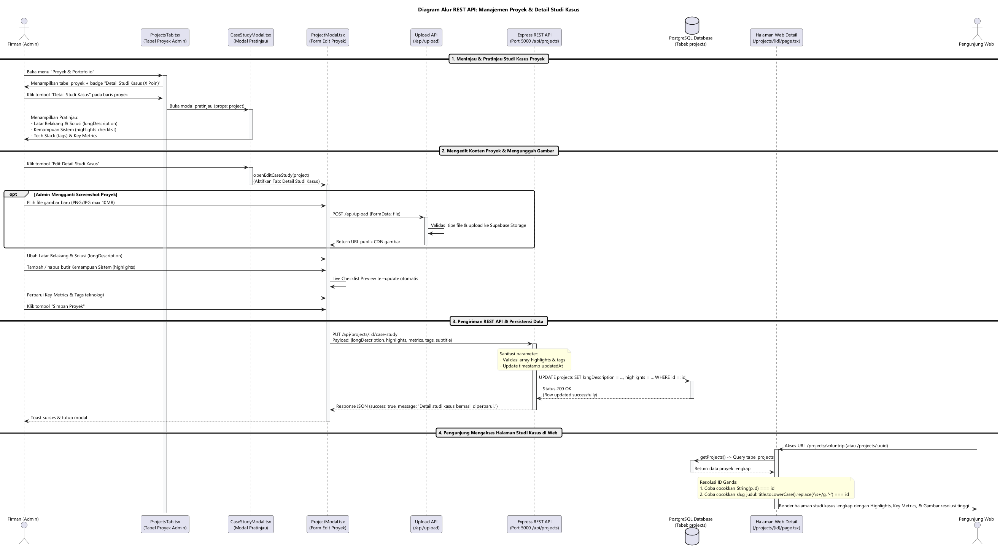
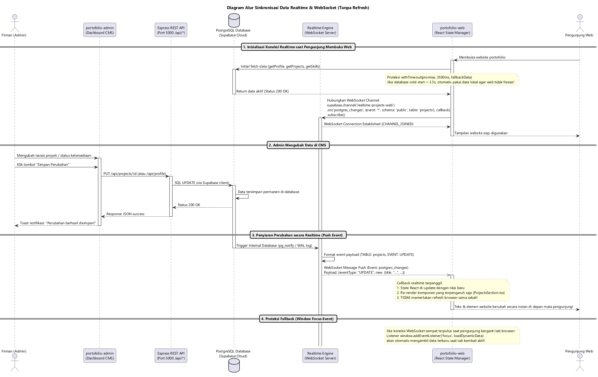
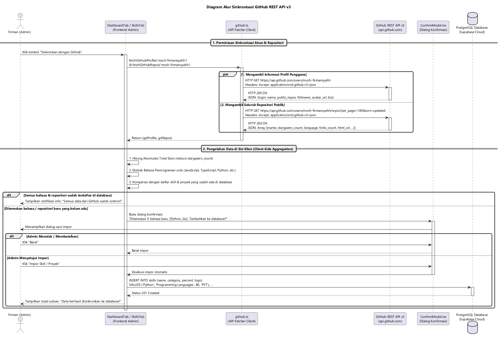
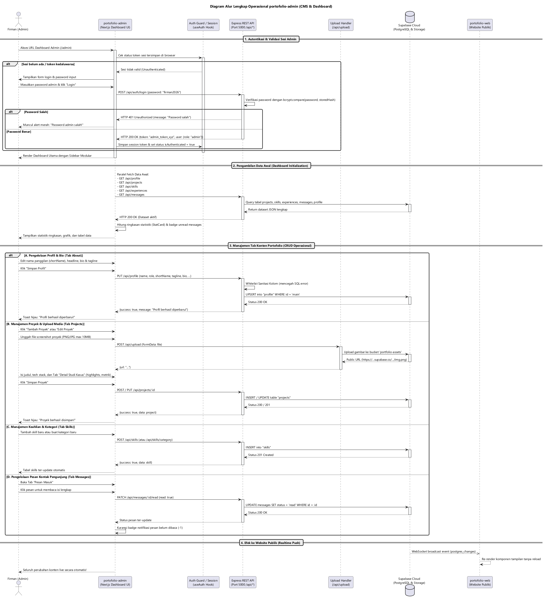

# 📘 Dokumentasi Lengkap Arsitektur REST API, Alur Sistem & Diagram Sekuens

Dokumentasi ini menyajikan arsitektur **REST API**, alur komunikasi data antara **`portofolio-web`**, **`portofolio-admin`**, dan **Backend Server**, manajemen **Detail Studi Kasus**, sinkronisasi ke **GitHub API v3**, mekanisme **Realtime WebSocket (tanpa refresh)**, serta daftar diagram urutan (**Sequence Diagram**) berbasis **PlantUML**.

> [!TIP]
> Folder [**`restapi/`**](file:///c:/Users/Firman/Documents/WebDev/Website/portofolio-firman-fix/restapi/) telah dirapikan secara modular. Berkas diagram PlantUML (`.puml`) dan gambar visualnya (`.png`) tersusun rapi di subfolder [**`diagrams/`**](file:///c:/Users/Firman/Documents/WebDev/Website/portofolio-firman-fix/restapi/diagrams/), koleksi Postman di [**`postman/`**](file:///c:/Users/Firman/Documents/WebDev/Website/portofolio-firman-fix/restapi/postman/), serta template env di [**`env-templates/`**](file:///c:/Users/Firman/Documents/WebDev/Website/portofolio-firman-fix/restapi/env-templates/).

---

## 📂 1. Peta Struktur Folder `restapi/`

```
restapi/
├── README.md                                          <-- Panduan Cepat & Indeks Berkas Utama
├── docs/
│   └── DOKUMENTASI_REST_API.md                        <-- Dokumentasi Spesifikasi Arsitektur Lengkap Ini
├── postman/
│   └── Portfolio_Backend_API.postman_collection.json  <-- Koleksi Postman Siap Pakai (1-Click Import)
├── diagrams/
│   ├── puml/                                          <-- Kode Sumber Diagram PlantUML (.puml)
│   │   ├── 01_arsitektur_global_dan_aliran_data.puml
│   │   ├── 02_alur_pengiriman_pesan_kontak.puml
│   │   ├── 03_alur_crud_proyek_dan_studi_kasus.puml
│   │   ├── 04_alur_sinkronisasi_realtime_web.puml
│   │   ├── 05_alur_sinkronisasi_github_api.puml
│   │   └── 06_alur_kerja_cms_portofolio_admin.puml
│   └── images/                                        <-- Render Gambar Visual PNG
│       ├── 01_arsitektur_global_dan_aliran_data.png
│       ├── 02_alur_pengiriman_pesan_kontak.png
│       ├── 03_alur_crud_proyek_dan_studi_kasus.png
│       ├── 04_alur_sinkronisasi_realtime_web.png
│       ├── 05_alur_sinkronisasi_github_api.png
│       └── 06_alur_kerja_cms_portofolio_admin.png
└── env-templates/                                     <-- Contoh Variabel Environment Vercel & Deployment
    ├── vercel-management-porto.env
    └── vercel-portofolio-web.env
```

---

## 🗺️ 2. Peta Arsitektur Ekosistem REST API

Sistem dibagi menjadi 3 pilar yang saling terhubung:

```
portofolio-firman-fix/
├── portofolio-web/                       <-- [Website Publik Portofolio (Port 3000)]
│   └── src/
│       ├── app/
│       │   ├── api/contact/route.ts      <-- POST /api/contact (Rate Limit 4/10mnt + Honeypot)
│       │   └── projects/[id]/page.tsx    <-- Halaman Publik Studi Kasus (Support Slug & UUID)
│       ├── components/
│       │   ├── layout/Footer.tsx         <-- Realtime sync shortName & status
│       │   ├── sections/ProjectsSection.tsx <-- Kartu proyek interaktif & detail modal
│       │   └── sections/ContactSection.tsx  <-- Formulir kontak publik dengan feedback interaktif
│       └── services/
│           ├── contact.ts                <-- Client fetcher untuk POST /api/contact
│           └── portfolio.ts              <-- Data fetcher dengan proteksi timeout & fallback statis
│
├── portofolio-admin/                     <-- [Dashboard Admin & Server REST API]
│   ├── backend/                          <-- [Express.js REST API Server (Port 5000)]
│   │   └── src/
│   │       ├── routes/                   <-- Router Express (/api/auth, /api/projects, dll)
│   │       ├── controllers/              <-- Controller terstruktur (Sanitasi, Sorting, dll)
│   │       └── middlewares/              <-- CORS & Error Handler terpusat
│   └── frontend/                         <-- [Next.js Dashboard Admin (Port 3001)]
│       └── src/
│           ├── app/api/upload/route.ts   <-- POST /api/upload (Supabase Storage 10MB limit)
│           ├── lib/api/github.ts         <-- Konsumen GitHub REST API v3
│           └── components/modals/
│               ├── ProjectModal.tsx      <-- Tab "2. Detail Studi Kasus"
│               └── CaseStudyModal.tsx    <-- Modal Pratinjau Cepat Studi Kasus
│
└── restapi/                              <-- [Dokumentasi, Diagram, & Koleksi Postman]
```

---

## 🌐 3. Spesifikasi Lengkap Endpoint REST API

### 3.1. Endpoint Publik & Pengiriman Pesan (`portofolio-web`)

#### `POST /api/contact`
* **File Handler**: `portofolio-web/src/app/api/contact/route.ts`
* **Port / Base URL**: `http://localhost:3000` (atau URL Vercel produksi)
* **Fungsi**: Menerima pesan kontak publik dari pengunjung website, menyaring spam/bot, validasi email RFC, dan menyimpan ke tabel `messages`.
* **Mekanisme Keamanan**:
  1. **Rate Limiting**: Maksimal **4 pesan per 10 menit per IP**. Request ke-5 akan dibalas dengan HTTP `429 Too Many Requests`.
  2. **Honeypot Trap**: Memeriksa input tersembunyi `botField`. Jika terisi (diisi oleh skrip bot otomatis), server langsung mengembalikan respons sukses `200 OK` palsu tanpa menyimpannya ke database.
  3. **Validasi Regex Email**: Memastikan sintaks email valid sesuai standar RFC.

**Contoh Request Body (JSON):**
```json
{
  "name": "Budi Santoso",
  "email": "budi@example.com",
  "subject": "Penawaran Kolaborasi Proyek",
  "message": "Halo Firman, saya sangat tertarik dengan karya portofolio web Anda...",
  "botField": ""
}
```

**Contoh Response:**
```json
// Berhasil (HTTP 200 OK):
{
  "success": true,
  "message": "Pesan Anda berhasil terkirim! Terima kasih telah menghubungi saya."
}

// Terkena Rate Limit (HTTP 429 Too Many Requests):
{
  "success": false,
  "error": "Terlalu banyak permintaan pesan. Silakan tunggu 10 menit sebelum mencoba lagi."
}
```

---

### 3.2. Endpoint Autentikasi Admin (`/api/auth`)

* **`POST /api/auth/login`**: Memverifikasi password admin dengan salted bcrypt hash secara asinkron (aman terhadap timing attack). Mengembalikan session token.
* **`GET /api/auth/session`**: Memeriksa apakah Bearer session token masih aktif dan valid.
* **`POST /api/auth/logout`**: Mengakhiri sesi login admin.

---

### 3.3. Endpoint Manajemen Proyek & Detail Studi Kasus (`/api/projects`)

* **`GET /api/projects`**: Mengambil semua daftar proyek portofolio.
* **`GET /api/projects/:id`**: Mengambil satu proyek spesifik berdasarkan ID (UUID atau Slug).
* **`POST /api/projects`**: Menambahkan proyek baru ke sistem.
* **`PUT /api/projects/:id`**: Memperbarui informasi proyek.
* **`DELETE /api/projects/:id`**: Menghapus proyek dari sistem.
* **`GET /api/projects/:id/case-study`**: Mengambil detail narasi studi kasus khusus halaman `/projects/[id]`.
* **`POST /api/projects/:id/case-study`**: Inisialisasi narasi dan checklist studi kasus baru.
* **`PUT /api/projects/:id/case-study`**: Memperbarui `longDescription`, `highlights` (array checklist), `metrics`, dan `tags`.

#### Struktur Data Proyek & Studi Kasus:
```typescript
{
  id: "77d251ee-839f-4293-8f5b-5c3abead89bd",
  title: "Voluntrip",
  subtitle: "Aplikasi Perencana Trip, Rundown Perjalanan Interaktif & Manajemen Budget Kelompok",
  description: "Platform perencana perjalanan modern yang dirancang untuk mempermudah traveler...",
  longDescription: "Voluntrip adalah platform perencana perjalanan modern yang dirancang untuk mempermudah...",
  category: "Web App",
  featured: true,
  image: "/projects/voluntrip.png",
  demoUrl: "https://voluntrip-five.vercel.app/",
  githubUrl: "https://github.com/moch-firmansyahh/voluntrip",
  metrics: "Drag & Drop • Real-time Budgeting • PWA Ready",
  highlights: [
    "Interactive Itinerary & Rundown Builder dengan Drag & Drop (Dnd-Kit)",
    "Autocomplete lokasi destinasi terintegrasi Photon OpenStreetMap API",
    "Expense Tracker & Split Bill kalkulator otomatis antar anggota trip"
  ],
  tags: ["Next.js 16", "TypeScript", "Tailwind CSS", "Supabase", "Dnd Kit", "PWA Ready"],
  year: "2026"
}
```

---

### 3.4. Endpoint Unggah Media & Gambar (`/api/upload`)

* **File Handler**: `portofolio-admin/frontend/src/app/api/upload/route.ts`
* **Metode**: `POST /api/upload`
* **Content-Type**: `multipart/form-data`
* **Fungsi**: Mengunggah screenshot proyek atau logo ke Supabase Storage (bucket `portfolio-assets` atau `projects`) dengan autentikasi Service Role dan mengembalikan URL CDN publik.
* **Batas Ukuran**: Maksimal 10 MB per berkas gambar (`image/png`, `image/jpeg`, `image/webp`, `image/svg+xml`).

---

### 3.5. Endpoint Keahlian & Kategori (`/api/skills`)

* **`GET /api/skills`**: Mengambil seluruh keahlian teknis.
* **`POST /api/skills`**: Menambahkan keahlian baru.
* **`PUT /api/skills/:id`**: Memperbarui nama, level, persentase, atau logo keahlian.
* **`DELETE /api/skills/:id`**: Menghapus keahlian berdasarkan ID.
* **`POST /api/skills/category`**: Membuat kategori baru beserta batch daftar keahlian di dalamnya.
* **`DELETE /api/skills/category/:category`**: Menghapus satu kategori beserta seluruh keahlian di bawahnya.

---

### 3.6. Endpoint Riwayat Pengalaman (`/api/experiences`)

* **`GET /api/experiences`**: Mengambil daftar pengalaman kerja, organisasi, dan pendidikan. Otomatis terurut secara kronologis dari periode terbaru ke terlama (`sortExperiences` mendukung format bulan Indonesia & Inggris, serta status "Present" / "Sekarang").
* **`POST /api/experiences`**: Menambahkan riwayat pengalaman baru.
* **`PUT /api/experiences/:id`**: Memperbarui riwayat pengalaman.
* **`DELETE /api/experiences/:id`**: Menghapus riwayat pengalaman.

---

### 3.7. Endpoint Pesan Masuk Admin (`/api/messages`)

* **`GET /api/messages`**: Mengambil daftar pesan dari pengunjung yang masuk melalui form kontak.
* **`PATCH /api/messages/:id/read`**: Memperbarui status baca pesan (`read: true / false`).
* **`DELETE /api/messages/:id`**: Menghapus pesan dari database.

---

### 3.8. Endpoint Profil Admin (`/api/profile`)

* **`GET /api/profile`**: Mengambil data profil lengkap untuk narasi Hero & About.
* **`PUT /api/profile`**: Memperbarui profil dengan sanitasi whitelist kolom otomatis (`name`, `role`, `shortName`, `tagline`, `about`, `bio`, `status`, `email`, `socialLinks`, `stats`, dll.) guna mencegah galat database.

---

## 📊 4. Sequence Diagram Arsitektur & Alur Kerja

Berikut adalah 5 diagram urutan resmi beresolusi tinggi yang menggambarkan seluruh alur data sistem:

### 4.1. Diagram 01: Arsitektur Global & Aliran Data Terpadu
> Berkas sumber: [`diagrams/puml/01_arsitektur_global_dan_aliran_data.puml`](../diagrams/puml/01_arsitektur_global_dan_aliran_data.puml)



---

### 4.2. Diagram 02: Alur Pengiriman Pesan Kontak Publik
> Berkas sumber: [`diagrams/puml/02_alur_pengiriman_pesan_kontak.puml`](../diagrams/puml/02_alur_pengiriman_pesan_kontak.puml)



---

### 4.3. Diagram 03: Alur CRUD Proyek & Detail Studi Kasus
> Berkas sumber: [`diagrams/puml/03_alur_crud_proyek_dan_studi_kasus.puml`](../diagrams/puml/03_alur_crud_proyek_dan_studi_kasus.puml)



---

### 4.4. Diagram 04: Alur Sinkronisasi Realtime Web (Tanpa Reload)
> Berkas sumber: [`diagrams/puml/04_alur_sinkronisasi_realtime_web.puml`](../diagrams/puml/04_alur_sinkronisasi_realtime_web.puml)



---

### 4.5. Diagram 05: Alur Sinkronisasi GitHub REST API v3
> Berkas sumber: [`diagrams/puml/05_alur_sinkronisasi_github_api.puml`](../diagrams/puml/05_alur_sinkronisasi_github_api.puml)



---

### 4.6. Diagram 06: Alur Kerja & Operasional portofolio-admin (CMS & Dashboard)
> Berkas sumber: [`diagrams/puml/06_alur_kerja_cms_portofolio_admin.puml`](../diagrams/puml/06_alur_kerja_cms_portofolio_admin.puml)



---

## 📑 5. Daftar Kode Status HTTP

| Kode Status | Keterangan | Penggunaan dalam Sistem |
| :---: | :--- | :--- |
| **`200 OK`** | Permintaan Berhasil | Mengambil data proyek, profil, atau status sesi admin. |
| **`201 Created`** | Data Baru Terbuat | Menambahkan proyek baru, keahlian baru, kategori, atau pesan kontak baru. |
| **`400 Bad Request`** | Data Tidak Valid | Masukan formulir tidak lengkap, format email salah, atau format file upload tidak didukung. |
| **`401 Unauthorized`** | Belum Terautentikasi | Password admin salah saat login, atau header Authorization Bearer token tidak valid. |
| **`404 Not Found`** | Tidak Ditemukan | Membuka rute proyek atau data dengan ID yang tidak terdaftar di database. |
| **`429 Too Many Requests`** | Batas Pengiriman Terlampaui | Pengunjung mengirim lebih dari 4 pesan kontak dalam kurun waktu 10 menit dari IP yang sama. |
| **`500 Internal Server Error`** | Kendala Internal Server | Terjadi galat jaringan database Supabase atau konfigurasi environment server belum diset. |
